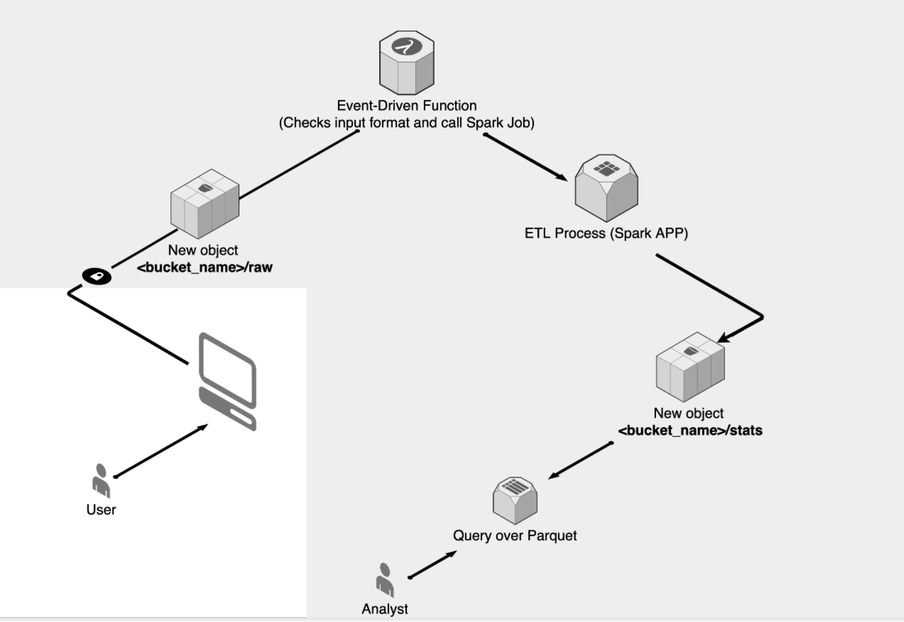

## Description
This project contains the code for a simple spark application that reads web traffic data and displays custom statistics.
#### Requirements
* Docker
* Web Traffic data should have the format defined in `input_schema.json`
#### Structure
* Code  of the app is in `src/stats`
* Test  of the app is in `src/tests`
#### Execution
To run the app we will use the file Makefile. To change the execution parameters we will use the `config.yml` file. 
```bash
# build the container, test the app and run it
make run input_zip=input-example.zip 
```


## Deployment
The design of the architecture of the application in production has been thought in a serverless environment, without using kubernetes, but completely serverless services from a cloud environment such as GCP or AWS. Those services are:
* **Data Storage**
	* AWS S3 [link](https://aws.amazon.com/es/s3/?nc=sn&loc=1)
	* GCP Cloud Storage [link](https://cloud.google.com/storage)
* **Event-Driven Functions**
	* AWS Lambda [link](https://aws.amazon.com/lambda/)
	* GPC Cloud Functions [link](https://cloud.google.com/functions)
* **ETL Process**
	* AWS EMR [link](https://aws.amazon.com/emr/)
		* Can be develop using docker [link](https://docs.aws.amazon.com/emr/latest/ReleaseGuide/emr-spark-docker.html)
	* GCP Dataproc [link](https://cloud.google.com/dataproc)
		* 	Can be develop using docker [link](https://cloud.google.com/dataproc/docs/concepts/components/docker)
* **From Data Storage to Analysis Tool**
	* AWS Redshift Spectrum [link](https://docs.aws.amazon.com/redshift/latest/dg/c-using-spectrum.html) 
	* GCP BigQuery External Data Source [link](https://cloud.google.com/bigquery/external-data-sources)

### Diagram

